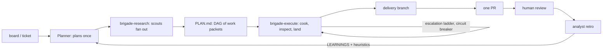

<p align="center">
  
</p>

A Claude Code **plugin** that turns your session into the planner of a cheap parallel
coding fleet.

Point it at a task board — Notion, ClickUp, an Obsidian vault, or a folder of markdown
files — and pick a ticket. Scouts research the codebase in parallel, the planner breaks
the ticket into small disjoint work packets, cooks implement them in isolated git
worktrees, an inspector adversarially reviews every diff before it lands, and you get one
PR to review.

You have exactly two jobs: approve the decomposition, and review the PR.

```bash
claude plugin marketplace add /path/to/brigade
claude plugin install brigade@brigade
```

Then, in a repo: `set up brigade`, and once that is done, `work my board`.

**[Quickstart](docs/quickstart.md)** · **[Usage](docs/usage.md)** ·
**[Configuration](docs/configuration.md)** · **[Architecture](docs/architecture.md)** ·
**[All docs](docs/index.md)**

## Why

The expensive model is the scarce resource. Brigade spends it on the one thing only it can
do — decomposition — and pushes everything else onto cheap subagents.

That only works if the packets are good. A weak model told to "add rate limiting to login"
produces garbage; the same model handed three named files, the contracts it needs pasted
in, and the exact command that proves it done produces mergeable code. The granularity
rules exist to make cheap execution viable, not to be tidy.

Four design goals, in order:

- **Minimum installable surface** — two skills, six agent files, no MCP server, no runtime
  daemon, no database.
- **Cheap execution** — the session plans and never explores or implements; token-heavy
  work runs on the tier's cheap models.
- **Trustable** — an adversarial review gate, real command output required as evidence,
  deterministic branch and worktree hygiene, and blocked work that comes back as a
  decision-ready question instead of a guessed value.
- **Self-improving** — an analyst pass at handoff feeds concrete failures back into the
  process.

## How a dish runs

A **dish** is one ticket cooked to completion.

<p align="center">
  
</p>



Two deterministic Workflow scripts drive the fleet: `brigade-research.js` fans questions
out to scouts, and `brigade-execute.js` runs the whole item DAG — worktree creation, the
escalation ladder, review, and rebase-and-fast-forward landing. Control flow lives in
JavaScript, not in a model deciding what to do next.

State lives in `PLAN.md` frontmatter and a typed report trail on disk, so any session can
resume mid-run and nothing already landed is re-cooked.

| SDLC role | Brigade form |
| --- | --- |
| requirements | grooming + two-stage grilling |
| analysis | scouts |
| design + design review | decomposition + blind plan check |
| implementation | cooks in worktrees |
| code review | inspector gate |
| integration | serialized rebase + fast-forward-only landing |
| CI runner | the workflow scripts |
| QA | verification gate + per-criterion acceptance pass |
| release | one human-review PR |
| retrospective | analyst |

## Service tiers

Pick how much model you buy per dish.

| | ★★★ "brigade heavy" | ★★ (default) | ★ "brigade light" |
| --- | --- | --- | --- |
| planning | frontier | opus | sonnet |
| first-attempt cook | heavy cook (sonnet) | cook (haiku) | cook (haiku) |
| scouts per dish | ≤ 6 | ≤ 4 | ≤ 2 |
| plan check | always | on triggers | never |
| analyst retro | every dish (intensive) + every 10 items (standard) | every dish | every 3rd dish |

Say `brigade heavy` or `brigade light` for one dish; set `tier` in config for the repo.
Any single row can be decoupled from its tier — see [docs/tiers.md](docs/tiers.md).

### Working memory

Long-horizon dispatches — heavy items and rework attempts — carry a working-memory
ledger: the packet's constraints held as protected Canon plus the cook's own verified
World state, kept in one bounded file per item, inherited across attempts, audited by
the Inspector. Small first-attempt items skip it; at that horizon the packet alone is
enough. On by default — set `workingMemory: false` in any config layer to disable.
Protocol: `skills/brigade/MEMORY.md`; adapted from
[arc-mem](https://github.com/jimador/arc-mem) (Activation-Ranked Context — governed
working memory for LLM agents).

## Configuration and overrides

Settings come from four layers, later winning key by key:

```
built-in defaults
  → ~/.brigade/config.json              personal, every repo
  → <repo>/brigade.config.json          committed, whole team
  → <repo>/.brigade/config.local.json   personal, this repo
```

Prompt overrides use the same layers but **stack** instead of replacing, so a repo can
tighten a global rule without losing it. Nothing an override says can remove the inspector
gate or the evidence requirements.

```bash
brigade-config resolve     # merged settings, and which layer set each key
brigade-config prompts     # prompt-override stacks, by role
brigade-config doctor      # validate every layer
```

Any role's agent is swappable — point `models.inspector` at your own reviewer and the
workflow scripts dispatch it instead. See [docs/configuration.md](docs/configuration.md)
and [docs/overrides.md](docs/overrides.md).

## What ships

| Path | What |
| --- | --- |
| `skills/brigade/SKILL.md` | the planner's brain: intake → research → decompose → dispatch → review → merge → handoff |
| `skills/brigade/SCHEMAS.md` | typed artifact registry — every plan, brief, report, and verdict has a fixed envelope and authority rule |
| `skills/brigade/TIERS.md` | service-tier reference and difficult-planning triggers |
| `skills/brigade/GRAPHITE.md` | optional Graphite modes, both off by default |
| `skills/brigade/sources/` | one adapter per ticket source, plus the four-operation template for writing your own |
| `skills/brigade/templates/` | per-repo board config, one example per settings layer, and the work-packet format |
| `skills/groom/SKILL.md` | board-grooming session: cluster, split, merge, sharpen. Never cooks |
| `agents/` | scout, cook, heavy cook, inspector, analyst, design |
| `commands/` | `/brigade:status`, `/brigade:config`, `/brigade:validate`, `/brigade:tier`, `/brigade:retro`, `/brigade:design`, `/brigade:review` |
| `bin/brigade-status` | zero-token dish-state summary; `--json` for tooling |
| `bin/brigade-config` | resolves the config layers and prompt-override stacks; `doctor` validates |
| `bin/brigade-validate` | zero-token schema conformance checker for dish artifacts |
| `bin/brigade-bundle` | regenerates `workflows/brigade-*.js`; `--check` catches drift |
| `workflows/` | the three Workflow scripts — `brigade-research.js`, `brigade-execute.js`, `brigade-review.js` — and the policy consts spliced into them |
| `hooks/` | SessionStart state injection and a PreToolUse git-hygiene guard |

## Requirements

`git`, `node`, and `python3`. `jq` unlocks `brigade-status --json`; `gh` lets brigade open
the PR for you. No MCP server is required — an MCP ticket source is used when the session
already has one, and falls back to REST or the filesystem otherwise.

Legacy copy install for environments without plugin support: `./install.sh --legacy`
(`./install.sh --uninstall` removes it).

## Naming

Kitchen vocabulary: a **dish** is one ticket cooked to completion, a **cook** implements
one work packet, the **inspector** reviews every diff, a **scout** researches, the
**analyst** runs the retro, the **steward** handles worktrees and landing, and **plating**
is handoff.

Branches are named for what they deliver, never for the process that made them — no
"brigade" in any branch name.
