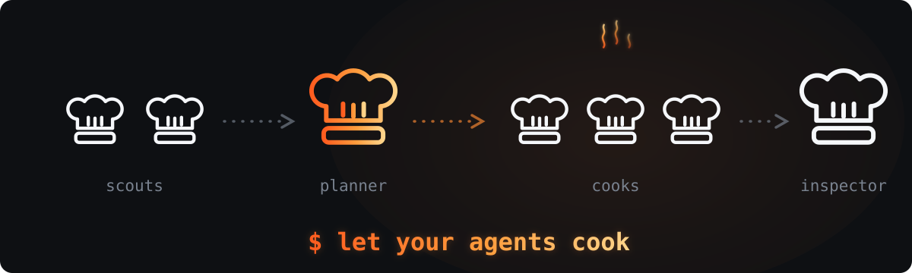
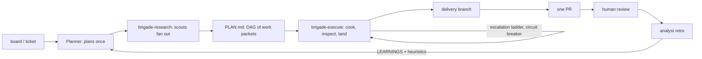

<p align="center">
  
</p>

A Claude Code **plugin** that turns your session into the planner of a cheap parallel
coding fleet.

Point it at a task board — Notion, ClickUp, an Obsidian vault, or a folder of markdown
files — and pick a ticket. Scouts research the codebase in parallel, the planner breaks
the ticket into small disjoint work packets, cooks implement them in isolated git
worktrees, an inspector adversarially reviews every diff before it lands, and you get one
PR to review.

You have exactly two jobs: approve the decomposition, and review the PR.

```bash
claude plugin marketplace add jimador/brigade
claude plugin install brigade@brigade
```

Working from a local clone, pass the clone's path to `marketplace add` instead.

Then, in a repo: `set up brigade`, and once that is done, `work my board`.

**[Quickstart](docs/quickstart.md)** · **[Usage](docs/usage.md)** ·
**[Configuration](docs/configuration.md)** · **[Architecture](docs/architecture.md)** ·
**[All docs](docs/index.md)**

## Why

The expensive model is the scarce resource. Brigade spends it on the one thing only it can
do — decomposition — and pushes everything else onto cheap subagents.

That only works if the packets are good. A weak model told to "add rate limiting to login"
produces garbage; the same model handed three named files, the contracts it needs pasted
in, and the exact command that proves it done produces mergeable code. The granularity
rules exist to make cheap execution viable, not to be tidy.

Four design goals, in order:

- **Minimum installable surface** — three skills, seven agent files, no MCP server, no runtime
  daemon, no database.
- **Cheap execution** — the session plans and never explores or implements; token-heavy
  work runs on the tier's cheap models.
- **Trustable** — an adversarial review gate, real command output required as evidence,
  deterministic branch and worktree hygiene, and blocked work that comes back as a
  decision-ready question instead of a guessed value.
- **Self-improving** — an analyst pass at handoff feeds concrete failures back into the
  process.

## How a dish runs

A **dish** is one ticket cooked to completion.

<p align="center">
  
</p>


```mermaid
flowchart LR
    Board[board / ticket] --> Planner[Planner: plans once]
    Planner --> Research[brigade-research: scouts fan out]
    Research --> Plan[PLAN.md: DAG of work packets]
    Plan --> Execute[brigade-execute: cook, inspect, land]
    Execute -->|escalation ladder, circuit breaker| Execute
    Execute --> Delivery[delivery branch]
    Delivery --> PR[one PR]
    PR --> Human[human review]
    Human --> Retro[analyst retro]
    Retro -->|LEARNINGS + heuristics| Planner
```

Two deterministic Workflow scripts drive the fleet: `brigade-research.js` fans questions
out to scouts, and `brigade-execute.js` runs the whole item DAG — worktree creation, the
escalation ladder, review, and rebase-and-fast-forward landing. Control flow lives in
JavaScript, not in a model deciding what to do next.

State lives in `PLAN.md` frontmatter and a typed report trail on disk, so any session can
resume mid-run and nothing already landed is re-cooked.

Claude and Codex Brigade use the same `.brigade` wire protocol. They share schemas,
configuration, artifact paths, PLAN statuses, branches, worktrees, and reports. An atomic
per-dish lease allows different dishes to run concurrently while keeping one writer for
the same dish; either runtime can release and hand the dish to the other at a human
checkpoint.

| SDLC role | Brigade form |
| --- | --- |
| requirements | grooming + two-stage grilling |
| analysis | scouts |
| design + design review | decomposition + blind plan check |
| implementation | cooks in worktrees |
| code review | inspector gate |
| integration | serialized rebase + fast-forward-only landing |
| CI runner | the workflow scripts |
| QA | verification gate + per-criterion acceptance pass |
| release | one human-review PR |
| retrospective | analyst |

## Service tiers

Pick how much model you buy per dish.

| | ★★★ "brigade heavy" | ★★ (default) | ★ "brigade light" |
| --- | --- | --- | --- |
| planning | frontier | opus | sonnet |
| first-attempt cook | heavy cook (sonnet) | cook (haiku) | cook (haiku) |
| scouts per dish | ≤ 6 | ≤ 4 | ≤ 2 |
| plan check | always | on triggers | never |
| analyst retro | every dish (intensive) + every 10 items (standard) | every dish | every 3rd dish |

Say `brigade heavy` or `brigade light` for one dish; set `tier` in config for the repo.
Any single row can be decoupled from its tier — see [docs/tiers.md](docs/tiers.md).

### Working memory

Long-horizon dispatches — heavy items and rework attempts — carry a working-memory
ledger: the packet's constraints held as protected Canon plus the cook's own verified
World state, kept in one bounded file per item, inherited across attempts, audited by
the Inspector. Small first-attempt items skip it; at that horizon the packet alone is
enough. On by default — set `workingMemory: false` in any config layer to disable.
Protocol: `skills/brigade/MEMORY.md`; adapted from
[arc-mem](https://github.com/jimador/arc-mem) (Activation-Ranked Context — governed
working memory for LLM agents). The Planner keeps a ledger of its own
(`state/planner.md`), and `brigade-status` prints its live World state so a resumed
session starts from verified facts.

## Configuration and overrides

Settings come from four layers, later winning key by key:

```
built-in defaults
  → ~/.brigade/config.json              personal, every repo
  → <repo>/brigade.config.json          committed, whole team
  → <repo>/.brigade/config.local.json   personal, this repo
```

Prompt overrides use the same layers but **stack** instead of replacing, so a repo can
tighten a global rule without losing it. Nothing an override says can remove the inspector
gate or the evidence requirements.

```bash
brigade-config resolve     # merged settings, and which layer set each key
brigade-config prompts     # prompt-override stacks, by role
brigade-config doctor      # validate every layer
```

Any role's agent is swappable — point `models.inspector` at your own reviewer and the
workflow scripts dispatch it instead. See [docs/configuration.md](docs/configuration.md)
and [docs/overrides.md](docs/overrides.md).

## The board

<p align="center">
  
</p>

Run `/brigade-board` to open the task board in a pane. While a dish is being worked, the header
names the repo and the dish's delivery branch, the ticket's title, and a detail line with the
ticket, its kind, how many work items are done and the service tier as `Effort:` with one to
three stars. At the top right, the context meter shows how full the session's context window
is, as a percent and a bar that turns amber at half full and red at three quarters.

The board is drawn differently on each surface. In the terminal it is an animated region:
sprites walk, and the pointer hovers and clicks. The desktop app does not load a plugin's
drawing region today, so there the hooks module draws the board as a picture with the same
header, lanes, cards, sprites, messages, learnings and legend. The picture fills the pane: it is
drawn about as wide as the pane (96 to 200 columns) and the app scales it to fit, and it only
changes when something on the board does. If the terminal's region does not load within 3
seconds, the terminal pane falls back to rows of text; opening the board again gives the region
another try. Other surfaces (mobile, the editor's panel) show the board as plain lines.

Below the header, five lanes hold one card for each work item of the dish being worked, titled
by the first sentence of the item's goal. The dish being worked is the one the working agent
seen most recently is on, so the board follows the main session from one dish to the next; an
agent that has been quiet for ten minutes no longer picks the dish. An item goes in the first
lane whose rule matches, looking at who is working it now, then at its newest report and
verdict, then at the plan's own status:

- **To do** holds items the plan has not dispatched yet; a heavy item carries a `heavy` pill.
- **Cooking** holds an item a cook is working, or one the plan has dispatched; when a cook works
  an item a review has already failed, the card says `second pass`.
- **In review** holds an item an inspector is working, or whose newest cook report no verdict
  has answered yet, or that the plan marks in review.
- **Rework** holds an item whose newest verdict is FAIL with no report since, with a
  `sent back · N findings` pill, or whose newest report says blocked; the plan's `rework` and
  `blocked` statuses land here too.
- **Done** holds an item whose newest verdict is PASS, unless the plan has sent it round again,
  or that the plan marks done.

A lane shows four cards (Done shows its two newest) and counts the rest as `+N more`; a card an
agent is working always shows. When no dish is being worked (no agent is working one, and no
plan that changed in the last day has unfinished items), the lanes show the board's tickets
instead, sorted into the same five lanes by status, and the header reads `Ticket board` with the
ticket count.

Every agent in the session is a retro pixel sprite, standing on the card it works, or with the
crew under the lanes when its card isn't on the board. Every sprite is one row tall, and its
colour tells the model: haiku, sonnet, opus or fable, as the legend at the bottom right shows; a
finished agent turns grey and a failed one red. Each sprite carries
its role mark, name and role (`♨ Miso · cook`) and an activity line: what its latest tool call
does, such as `reading gateway.ts`, `editing bucket.ts` or `running tests`, and `finished` once
it is done. The role shows once the board can tell it, from the agent's type or label or from
what it writes (an edit in a worktree makes a cook, a verdict an inspector, a brief a scout);
until then it reads `agent`. A sprite stands still on its card and moves only while it walks
there: when its card moves, it walks to the card's new lane, a step every quarter second, never
overlapping another sprite or a name line. In the terminal a new sprite walks in from the left
edge; in the desktop app it appears in place on its card. In the terminal, point at a sprite for
a hover card with its model, item, state, tokens and running time. The desktop picture has no
tooltips; the buttons under it open each agent's details. A finished agent stays on the board
for two minutes.

The Messages panel shows the newest four messages, made from the notes agents leave in the dish
folder: a cook's report reads `Miso → inspector: token-bucket ready for review`, a failed verdict
goes from the inspector back to the cook with its first finding, and a passed verdict, a blocked
report, a scout's brief and a plan check go to the planner. The cook or inspector in a message
is named when exactly one agent in that role is on the item, and goes by the role otherwise. The
Learnings panel lists up to five of the newest learnings in `.brigade/LEARNINGS.md`: each `## `
heading, or each bullet of a dated retro section.

In the terminal, click a card, an agent or a message to open a detail box over the board, and
click `[x]` or anywhere off the box to close it. Clicks do not reach the desktop app's picture,
so a row of buttons under it opens the detail of a card, an agent or a message, and closes it;
the terminal's fallback rows carry the same buttons. A work item's box has its goal, files,
dependencies, attempts, newest cook report, newest review with its findings, and every agent on
the item; a ticket's box has its title, kind, assignee and goal; an agent's has its model, item,
activity, tokens, running time and the tail of its working memory; a message's has its text,
its item, the file it came from and the start of that file.

The pane asks its dock for 124 columns, enough for five lanes side by side; in the terminal,
below 104 columns the lanes wrap into bands, and below 70 the two panels stack. The board reads the ticket folder
`.brigade/config.md` names, the dish folders under `.brigade/dishes/` and
`.brigade/LEARNINGS.md`, and writes no files. It needs a Claude Code build with mods (function
hooks).

The demo above is generated by `scripts/board-demo`, which plays one made-up run through the
board's own code and draws every frame with it; the whole run plays in under 30 seconds.

## What ships

| Path | What |
| --- | --- |
| `skills/brigade/SKILL.md` | the Planner's router: standing rules, the dish checklist, and pointers into the phase companions |
| `skills/brigade/DECOMPOSE.md` · `EXECUTE.md` · `HANDOFF.md` | the phase companions: decomposition rules and the plan check; pre-flight, the execute ledger, stop conditions; the handoff and acceptance pass |
| `skills/brigade/COORDINATION.md` · `CONFIG.md` | the Claude/Codex dish lease and wire contract; settings layers and prompt overrides |
| `skills/brigade/SCHEMAS.md` | typed artifact registry — every plan, brief, report, and verdict has a fixed envelope and authority rule |
| `skills/brigade/TIERS.md` | service-tier reference and difficult-planning triggers |
| `skills/brigade/GRAPHITE.md` | optional Graphite modes, both off by default |
| `skills/brigade/sources/` | one adapter per ticket source, plus the four-operation template for writing your own |
| `skills/brigade/writing/` | writing presets; `ste-80.md` holds the sentence rules the Planner writes work packets to when the preset is on |
| `skills/brigade/templates/` | per-repo board config, one example per settings layer, and the work-packet format |
| `skills/groom/SKILL.md` | board-grooming session: cluster, split, merge, sharpen. Never cooks |
| `agents/` | scout, cook, heavy cook, inspector, analyst, design, designer |
| `commands/` | `/brigade:status`, `/brigade:config`, `/brigade:validate`, `/brigade:tier`, `/brigade:retro`, `/brigade:design`, `/brigade:ui`, `/brigade:review` |
| `scripts/brigade-status` | zero-token dish-state summary; `--json` for tooling |
| `scripts/brigade-config` | resolves the config layers and prompt-override stacks; `doctor` validates |
| `scripts/brigade-coord` | atomic per-dish Claude/Codex ownership and handoff leases |
| `scripts/brigade-validate` | zero-token schema conformance checker for dish artifacts |
| `scripts/brigade-evidence` | zero-token verification-scope classifier — stops a targeted pass being read as repo green |
| `scripts/brigade-bundle` | regenerates `workflows/brigade-*.js`; `--check` catches drift |
| `scripts/board-demo` | regenerates the board demo in this README from the board's own drawing code; `--check` catches drift |
| `workflows/` | the three Workflow scripts — `brigade-research.js`, `brigade-execute.js`, `brigade-review.js` — and the policy consts spliced into them |
| `hooks/` | SessionStart state injection, a PreToolUse git-hygiene guard, and a SubagentStop artifact-validate gate |
| `hooks/board/` | the live board pane (`/brigade-board`): the task board with agents as pixel sprites coloured by model, a context meter, Messages and Learnings panels, and a detail box on click in the terminal, from a button on desktop |
| `evals/` | `claude plugin eval` suite: eleven expected-workflow cases with scaffolded fixtures; results stay local |
| `docs/intent.md`, `docs/experiments.md` | what the plugin optimizes for, and the log of hypotheses tested — result and decision per experiment |

## Writing rules

Each artifact can carry its own writing rules: plain sentences in the `writing` block of any
config layer, handed only to the agent that writes that artifact (`packet`, `plan`, `brief`,
`report`, `verdict`, `ticket_comment`, `pr_body`). Rules stack across layers like prompt
overrides.

The `ste-80` preset holds work packets to short sentences with one instruction each, based
on the sentence rules of Simplified Technical English. It is off by default. Turn it on in
any layer:

```json
{ "writing": { "preset": "ste-80" } }
```

`brigade-config writing --json` prints the resolved block. With the preset on, the Planner
writes `writing: ste-80` into the plan, and `brigade-validate` warns on a step sentence over
20 words, a description sentence over 25, a step with more than one instruction,
vendor-specific markup, and any word the `checks.packet.terms` map bans. Misses are warnings
only; none fails a plan. Details in `skills/brigade/CONFIG.md`.

Whether the preset helps is experiment E-004 in `docs/experiments.md`, run by an operator
with the kit in `evals/experiments/writing-rules/`. It is pending: no result yet.

## Requirements

`git`, `node`, and `python3`. `jq` unlocks `brigade-status --json`; `gh` lets brigade open
the PR for you. No MCP server is required — an MCP ticket source is used when the session
already has one, and falls back to REST or the filesystem otherwise.

Legacy copy install for environments without plugin support: `./install.sh --legacy`
(`./install.sh --uninstall` removes it).

## Naming

Kitchen vocabulary: a **dish** is one ticket cooked to completion, a **cook** implements
one work packet, the **inspector** reviews every diff, a **scout** researches, the
**analyst** runs the retro, the **steward** handles worktrees and landing, and **plating**
is handoff.

Branches are named for what they deliver, never for the process that made them — no
"brigade" in any branch name.

## License

MIT. See [LICENSE](LICENSE).
