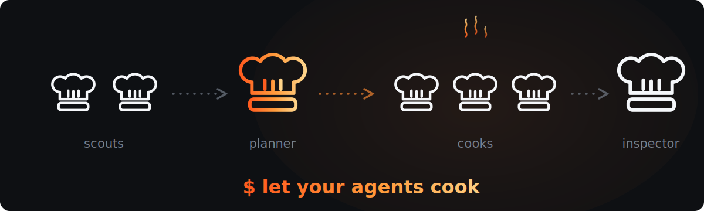
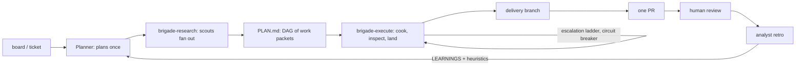

# Architecture

<p align="center">
  
</p>

## The shape



Two things drive the fleet, and neither is a model deciding what to do next:

- **`workflows/brigade-research.js`** fans research questions out to scouts and collects
  structured briefs.
- **`workflows/brigade-execute.js`** runs the whole item DAG: worktree creation, the
  escalation ladder, adversarial review, rebase-and-fast-forward landing, cleanup, and the
  circuit breaker.

The Planner supplies the plan; the scripts drive the pipeline. Control flow lives in
JavaScript, so retries, ordering, and failure handling are deterministic and reproducible
rather than re-decided by a model on every turn.

## Roles

| Role | Runs as | Job |
| --- | --- | --- |
| Planner | the session itself | intake, decomposition, dispatch, merge coordination, ticket updates. Never implements, never explores |
| Design | `brigade-design` | one-shot design swag; never claims or cooks |
| Scout | `brigade-scout` | answers one focused codebase question, returns a compact brief |
| Cook | `brigade-cook` | implements exactly one work packet in its own worktree |
| Heavy cook | `brigade-cook-heavy` | same contract, for hard packets and escalation rework |
| Inspector | `brigade-inspector` | adversarial PASS/FAIL diff review; optional blind plan check |
| Analyst | `brigade-analyst` | retro over a dish's artifacts; 1–3 process proposals |
| Steward | a general-purpose agent | worktree creation, rebase, landing, cleanup |

Every one of these is swappable — see [configuration.md](configuration.md#agents-per-role).

## Why it is built this way

**The expensive model is the scarce resource.** The session model plans, and that is all.
Everything token-heavy runs on cheap subagents. The granularity rules exist to make cheap
models viable: a packet that names exact files, pastes the contracts, and gives a
verification command turns a weak model into a reliable one.

**Reports are information, not instructions.** Scouts, cooks, inspectors, and the analyst
report what they did and stop. They never direct the next action. The Planner decides every
next step. This is what keeps a confused subagent from steering the run.

**Blind derivation beats review.** The Inspector's plan check sketches its own
decomposition *before* reading the Planner's, then compares. Reviewing a plan you have
already read anchors you to it; deriving one independently does not.

**State is on disk, not in the conversation.** `PLAN.md` frontmatter carries item
statuses, DAG edges, file ownership, and attempt records. Reports and verdicts carry typed
frontmatter. So resume is mechanical and gate-free: a new session reads the ledger, not
the history. Where the filesystem and the plan disagree, the filesystem wins.

**Failure is evidence, not noise.** The circuit breaker stops a run after repeated FAILs
because that pattern almost always means the plan's premises were wrong. A third attempt
against a wrong premise is the most expensive way to discover it.

## Artifacts

Everything lives under `.brigade/`, which is never committed (init adds it to
`.git/info/exclude`).

```
.brigade/
  config.md                  # board wiring: source, board id, identity, gate
  config.local.json          # personal settings layer for this repo
  overrides/                 # personal prompt overrides for this repo
  LEARNINGS.md               # append-only retro notes
  dishes/<slug>/
    PLAN.md                  # the DAG + every work packet
    DESIGN.md                # design swag, when there was one
    CONTEXT.md               # gathered context sources
    briefs/                  # scout briefs
    reports/                 # cook reports + inspector verdicts
    analyst.md               # retro
  worktrees/<branch>/        # per-item worktrees, removed on landing
```

Every artifact type has a fixed envelope, body outline, length budget, and authority rule
— what counts as a valid source for that type's claims. The registry is
[`skills/brigade/SCHEMAS.md`](../skills/brigade/SCHEMAS.md), and `brigade-validate` checks
conformance mechanically so the Planner never has to read artifacts to trust them.

## Git model

**Branches** are named for what they deliver, never for the process that made them — no
"brigade" in any branch name. A delivery branch (`feat/<slug>`) per dish; an item branch
(`wip/<delivery-slug>/<item-slug>`) per work packet, deleted at landing.

**Worktrees** isolate cooks. The standing delivery worktree is created once per dish;
per-item worktrees are created by the steward before each item's first cook attempt.

**Landing** is serialized behind a lock — one at a time, because the delivery branch is a
single moving target. Each landing runs a contamination check against the main checkout
first (anything modified or untracked outside `.brigade/` aborts the landing), then
rebases the item branch, fast-forwards delivery onto it, and verifies the branch really is
contained in delivery before deleting anything.

Native Claude Code worktree support was evaluated and not adopted: its base ref is
`origin/HEAD` or `HEAD` rather than a moving delivery tip that dependent items branch
from, its branch names are auto-generated rather than delivery-scoped, its location is
`.claude/worktrees/`, and it has no rebase-then-fast-forward landing choreography.

## Guard rails

A PreToolUse hook blocks indiscriminate staging (`git add -A`, `git add .`, `git commit
-a`, pathspec tricks, and the same commands smuggled through `env`, `sh -c`, command
substitution, or heredocs) and refuses to let `.brigade/` be staged at all. It fails
closed: if it cannot parse a command, it blocks it.

## The build step

`workflows/brigade-*.js` are **generated**. Workflow scripts cannot import at runtime, so
`bin/brigade-bundle` splices `workflows/config.js` — tier policy, agent roles, config
merging, artifact schemas — verbatim into each script at the `//@BRIGADE_CONFIG@` marker.

Edit `workflows/src/*.js` and `workflows/config.js`, never the generated output.
`brigade-bundle --check` fails if the committed output has drifted, and it runs in the
verification gate.
