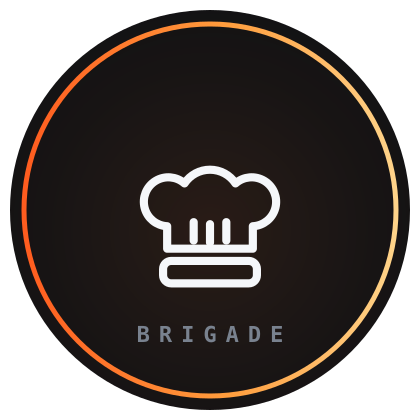

# Brigade documentation

  

A Claude Code plugin that turns one session into the planner of a parallel dev fleet.

## Start here

- **[quickstart.md](quickstart.md)** — nothing to a merged PR in ten minutes, no service
  or token required
- **[usage.md](usage.md)** — every phrase, slash command, and shell command, and what each
  actually does

## Configure it

- **[configuration.md](configuration.md)** — the four settings layers, every key, and how
  to see which layer won
- **[overrides.md](overrides.md)** — prompt and agent overrides that stack across layers
- **[tiers.md](tiers.md)** — service tiers, and how to override one row of a tier

## Understand it

- **[architecture.md](architecture.md)** — the pipeline, the roles, the git model, and why
  it is built this way
- **[sources.md](sources.md)** — ticket sources and the four-operation adapter contract
- **[intent.md](intent.md)** — what brigade optimizes for, its bet and non-goals, and how the intent changes
- **[experiments.md](experiments.md)** — hypotheses the fleet has tested: setup, metric, result, decision

## When it goes wrong

- **[troubleshooting.md](troubleshooting.md)** — blocked items, stopped runs, config that
  seems ignored, landing failures

## Reference (ships with the plugin)

- [`skills/brigade/SKILL.md`](../skills/brigade/SKILL.md) — the Planner's router: standing rules, the dish checklist, and pointers into the phase companions
- [`skills/brigade/DECOMPOSE.md`](../skills/brigade/DECOMPOSE.md) — Phase 2: premise rules, DAG rules, the haiku bar, heavy flags, the plan check
- [`skills/brigade/EXECUTE.md`](../skills/brigade/EXECUTE.md) — Phases 3–5: pre-flight, the execute workflow, the ledger, stop conditions
- [`skills/brigade/HANDOFF.md`](../skills/brigade/HANDOFF.md) — Phase 6: proving the gate, the acceptance pass, PR or push, ticket, retro
- [`skills/brigade/COORDINATION.md`](../skills/brigade/COORDINATION.md) — the Claude/Codex dish lease and wire contract
- [`skills/brigade/CONFIG.md`](../skills/brigade/CONFIG.md) — settings layers, resolution, prompt overrides
- [`skills/brigade/MEMORY.md`](../skills/brigade/MEMORY.md) — working memory: the cook ledger and the Planner's ledger
- [`evals/`](../evals/) — the `claude plugin eval` suite: eight expected-workflow cases with fixtures
- [`skills/brigade/SCHEMAS.md`](../skills/brigade/SCHEMAS.md) — the typed artifact registry
- [`skills/brigade/TIERS.md`](../skills/brigade/TIERS.md) — machine-readable tier policy
- [`skills/brigade/GRAPHITE.md`](../skills/brigade/GRAPHITE.md) — optional Graphite modes
- [`skills/groom/SKILL.md`](../skills/groom/SKILL.md) — the board-grooming session
- [`skills/brigade/sources/`](../skills/brigade/sources/) — one file per ticket source
- [`CONTRIBUTING.md`](../CONTRIBUTING.md) — how to change the plugin safely
