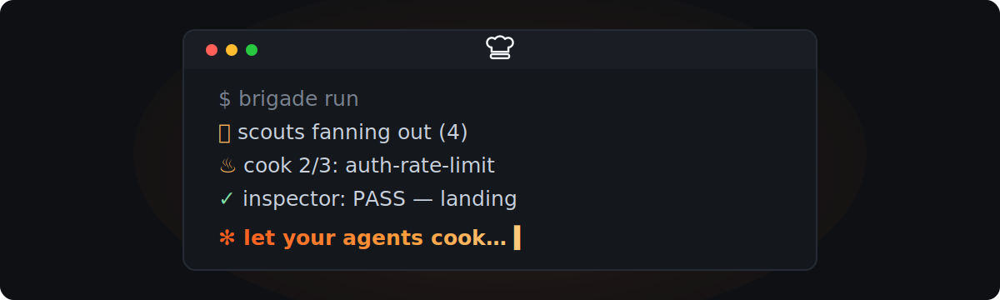

# Usage

Everything you can say or run, and what it actually does.

<p align="center">
  
</p>

## The shape of a session

You talk to the **Planner** — the Claude Code session itself. It never reads source files
or writes code; it plans, dispatches, and reports. All the token-heavy work happens in
subagents you never talk to directly.

A **dish** is one ticket cooked to completion. It has exactly two human checkpoints:
approving the decomposition, and reviewing the PR.

## Phrases

| Say this | What happens |
| --- | --- |
| `set up brigade` | First-run init: picks the source, interviews you, writes `.brigade/config.md` |
| `work my board` | Lists your assigned tickets; you pick one; the full loop runs |
| `work <ticket> with brigade` | Straight to research and decomposition for a named ticket |
| `groom my board` | Grooming session — cluster, split, merge, sharpen. Never cooks |
| `swag this ticket` / `flesh out the design` | One-shot design pass; leaves the ticket in `design` with open questions |
| `continue the dish` | Resumes from `PLAN.md` in any session, any time |
| `brigade heavy` | Run this one dish at ★★★ |
| `brigade light` | Run this one dish at ★ |

The trigger phrases override the configured tier for a single dish. To change the default,
set `tier` in config or run `/brigade:tier`.

## Slash commands

| Command | What it shows |
| --- | --- |
| `/brigade:status` | Tier, each dish's items by status, worktrees, efficiency numbers |
| `/brigade:config` | Resolved settings, which layer set each, prompt overrides, validation |
| `/brigade:validate` | Schema conformance of every dish artifact |
| `/brigade:tier` | Show or set the repo's default service tier |
| `/brigade:retro` | Run the analyst pass on the current dish now (intensive at ★★★; `--standard`/`--intensive` to override) |
| `/brigade:design` | Design swag for a ticket without claiming or cooking it |
| `/brigade:review` | Advisory, tier-scaled code review of a branch, PR, or commit range |

## Shell commands

On the session's PATH whenever the plugin is enabled. All of them cost zero model tokens —
reach for these instead of asking Claude to read state.

```bash
brigade-status                  # dish state: config, items, worktrees, efficiency
brigade-status --json           # same, structured (needs jq)

brigade-config resolve          # merged settings + winning layer per key
brigade-config get tier         # one value
brigade-config layers           # which layer files exist, in precedence order
brigade-config prompts          # prompt-override stacks, by role
brigade-config prompt cook      # the resolved override text for one role
brigade-config doctor           # validate every layer; exit 1 on problems

brigade-validate                # schema-check every dish artifact
brigade-validate <path.md>...   # check specific files
brigade-validate --json         # structured results

brigade-bundle                  # regenerate workflows/ from workflows/src/
brigade-bundle --check          # fail if generated output is stale
```

## The phases, in order

**0 — Intake.** Resolve which ticket, read it once, sweep your other open tickets for
scope overlap. A raw idea gets grilled first — product intent, then system shape — until a
spec can be written without hedging.

**1 — Research.** The Planner writes focused questions and fans them out to scouts, which
read the codebase in parallel and return short briefs with pasted contracts and anchors.
The tier caps how many scouts run; anything dropped is logged, never silently skipped.

**2 — Decompose.** The Planner splits the ticket into work items that each touch 1–3 named
files, change roughly ≤150 lines, do one thing, and need zero exploration because
everything the cook needs is already in the packet. Items in the same wave never share
files — anything that overlaps gets a dependency edge instead.

This is the expensive thinking, and it happens once. At ★★★ (and at ★★ on triggers) an
Inspector blind-sketches its own decomposition first, then critiques the Planner's — the
comparison catches coverage gaps that groupthink would miss.

**You approve the plan here.**

**3–5 — Execute.** A deterministic script runs the DAG: create a worktree per item, cook,
inspect, escalate on FAIL, then rebase and fast-forward onto the delivery branch — one
landing at a time, with a contamination check that refuses to land if anything outside
`.brigade/` is dirty in the main checkout.

Repeated failure trips a **circuit breaker**. That is a signal the plan's premises were
wrong, not bad luck; the run stops and hands back to you rather than burning another
attempt against a bad assumption.

**6 — Handoff.** Full verification gate on the integration branch, an acceptance pass over
every criterion, one PR, the ticket moved to in-review with a plain-language comment, and
an analyst retro.

## Reviewing code on demand

`/brigade:review <branch|PR|range>` runs an advisory code review outside the six phases
above — no packet, no PASS/FAIL gate, and it never posts to a pull request. It scales
review depth to the tier (more dimensions and a stronger verify pass at ★★★, a single
merged pass at ★) and returns findings that are already packet-shaped, so any of them can
be handed to the execute pipeline later as a work item. See `skills/brigade/SKILL.md`'s
"Reviewing code" section for the full contract.

## When something blocks

Brigade never guesses a value to keep moving. A blocked item comes back as a
**decision-ready question**: the exact missing value, the options, and a recommendation.
Answer it and re-run execute.

Ladder exhausted with no PASS is the one case the Planner fixes itself — announced, with a
minimal diff, re-inspected before landing.

## Self-improvement

Retros compound in three layers:

1. **Every dish (cadence set by tier)** — the analyst scores the run from its own
   artifacts and proposes 1–3 evidence-backed process changes. Repo-local ones land in
   `.brigade/LEARNINGS.md`, re-read at every dish start. At three-star the end-of-dish
   retro is **intensive**: a stronger model with cross-dish inputs, a closure ledger over
   past proposals (applied / ignored / dead), and web-backed tooling research — up to 5
   proposals, which may include adopting a tool, lint rule, CI step, or hook. Tooling
   proposals are yours to apply; nothing is ever auto-installed.
2. **Across repos** — proposals that generalize go to your knowledge base (if you have one
   configured) or `skills/brigade/policies/heuristics.md` for teams.
3. **Periodically** — a heavy-model pass folds accumulated heuristics into the plugin
   source itself, you review the diff, and absorbed heuristics are retired so they are
   never re-proposed.

The fleet never edits its own installed brain. Upgrades go source → your review → rollout.

## Cost control

The whole design is about not spending the expensive model on cheap work:

- The Planner plans once and never explores or implements.
- Scouts, cooks, inspectors, and analysts run on the tier's cheap models.
- `brigade-status`, `brigade-config`, and `brigade-validate` answer state questions for
  free, and the SessionStart hook injects a snapshot so a resumed session does not
  re-read artifacts.
- Escalation is per item and evidence-driven — never fleet-wide.

The granularity rules in Phase 2 exist for this reason: a cheap cook handed exact files,
contracts, and a verification command produces mergeable code, while the same model told
to "look around for the auth logic" produces garbage.
