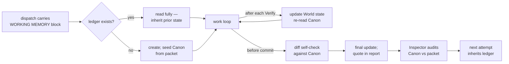

# Working memory — the cook's ledger

A ledger is a small, bounded markdown file a cook maintains while working one item:
the packet's load-bearing constraints held active and protected, plus the cook's own
verified state of the world. It exists because constraints demonstrably lose force as
a transcript grows — the pattern here adapts a governed-working-memory design whose
ablation evidence showed that an explicit, bounded, protected fact set kept active in
the prompt delivers the benefit; rank/trust/decay scoring machinery does not, and no
runtime exists to compute it anyway.

## Who gets a ledger

- **Heavy items** (`heavy: true`) — always, from attempt 1.
- **Any rework attempt** (attempt ≥ 2, any model) — the ledger is also how an attempt
  inherits its predecessor's verified facts instead of re-deriving them.
- **Small first-attempt items** — no ledger. Evidence across dishes: zero reworks on
  ≤3-file first attempts; the packet alone is sufficient working memory at that horizon.

The execute script decides: a dispatch that qualifies carries a `WORKING MEMORY` block
naming the ledger path and pasting the schema. No block, no ledger — don't create one.

Working memory is **on by default**. Setting `workingMemory: false` in any brigade
config layer (global, team, or repo-local JSON) disables it fleet-wide — the execute
script then never emits the block, at any tier.

## The file

One per item, shared across attempts, outside every worktree so it survives worktree
removal and is readable by the Inspector and the next attempt:

`.brigade/dishes/<dish-slug>/state/<item-slug>.md`

RFC 2119 keywords define compliance obligations: MUST = absolute requirement, violation
invalidates the work; SHOULD = deviation requires stated justification; MAY = optional.

### Canon — MUST hold (absolute requirement)

Seeded once from the packet before the first edit, then **never edited**: the file list,
each quoted contract, every Verify command, every named invariant/hazard. ≤ 20 numbered
units (`C1.` …). If reality contradicts a Canon unit, that is a packet defect: report
BLOCKED with the contradiction as evidence. Never "fix" Canon to match what you built.

Nothing you learn while working belongs in Canon — not even prior-attempt inspector
findings. Those are verified facts about the world, so they go in World state as
`[RELIABLE]` units (anti-example from the ledger's first live dish: a rework cook wrote
findings F1/F2 into Canon; the Inspector's audit flagged it).

### World state — maintained by the cook

Numbered units (`W1.` …), each tagged:

- `[RELIABLE]` — verified by a command you ran; name the command in the unit.
- `[PROVISIONAL]` — inferred or assumed; MAY be reconsidered, SHOULD be verified before
  anything load-bearing is built on it.

Supersede by striking (`~~old text~~`) and adding a new unit `(supersedes Wn)` — never
delete. ≤ 30 live units; on overflow move struck/stale units to `## Archive`.

## Cadence — event-anchored, never optional

Counting tool calls gets skipped under pressure; these events don't:

1. **Before the first edit** — if the ledger exists, read it fully (it is the prior
   attempt's verified state); otherwise create it and seed Canon from the packet.
2. **After every Verify run** — record outcomes in World state, then re-read Canon top
   to bottom.
3. **Before commit** — self-check the diff against Canon: files ⊆ the Canon file list,
   no invariant violated, every Verify command run.
4. **Before the report** — final update; quote the live World state in the report's
   Evidence and set `ledger:` in the report frontmatter.

Skipped upkeep is visible by design: a ledgered dispatch whose report lacks the ledger
path or World-state quote is an Inspector finding, as is a ledger whose `updated:` stamp
predates the final commit.

## Lifecycle

## What was deliberately dropped

Activation ranks, trust scores, decay, tier thresholds, authority promotion/demotion:
all runtime-scoring machinery a self-maintained markdown file cannot honestly compute,
and the ablation evidence says the bounded protected set carries the benefit without
them. Two tags (`[RELIABLE]`/`[PROVISIONAL]`), one protected section, one supersession
rule — that is the whole mechanism.

## Provenance

Adapted from [arc-mem](https://github.com/jimador/arc-mem) — Activation-Ranked Context
(ARC), a governed working-memory model for LLM agents. Its simulation ablations are the
evidence base for this protocol's central simplification: every ARC-enabled condition
scored within ~1.6 resilience points regardless of which governance subsystem was
removed, while the no-governance baseline dropped ~19 points — the bounded, protected,
actively re-injected fact set is the mechanism that matters. The authority-tier
vocabulary (CANON-style protected units, RFC 2119 compliance phrasing) and the
supersede-never-delete lifecycle are lifted from its prompt templates and domain model.
